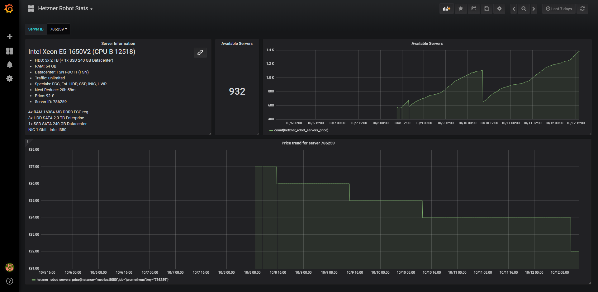

# Hetzner Robot Price Statistics

Price statistics and alerting of the [Hetzner Robot](https://hetzner.de/sb) analyzed via Prometheus and Grafana.

## Getting Started

There is a public hosted instance available [here](https://hetzner.schmitt.mx/d/QWw7Ad1iz/hetzner-robot-stats?orgId=1).

Otherwise you can setup your own hosted instance via the deployment instructions.

## Deployment

For deployment `docker-compose` is used. It will deploy a Grafana instance on port 8080. For more information, checkout the [docker-compose.yml](./deployments/docker-compose.yml).

The following TODOs have to be done after the deployment:

- Create Data Source `Prometheus` with URL `http://prometheus:9090`
- Import Grafana dashboard from [grafana.json](./deployments/grafana.json)

## Built With

- [Grafana](https://grafana.com) - Analysis Webinterface
- [Prometheus](https://prometheus.io) - Metric Storage
- [Golang](https://golang.org) - Programming language in which the metrics daemon was written in

## License

This project is licensed under the MIT License - see the [LICENSE](LICENSE) file for details.